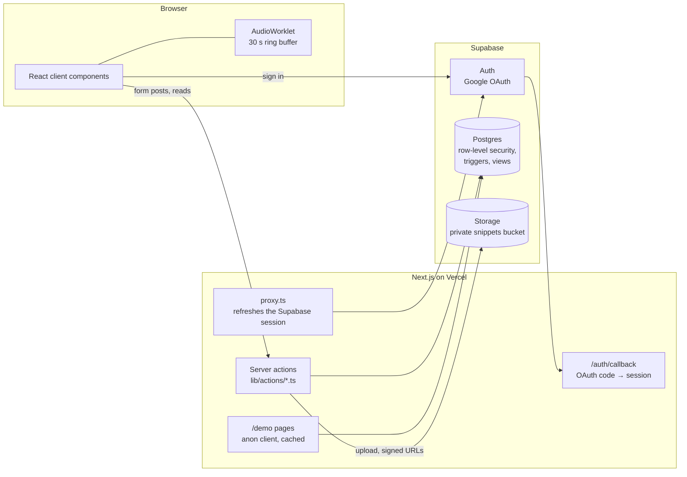

# Virtuoso

A social practice tracker for musicians, like Strava for practice sessions. Musicians time and log their practice, save the last 30 seconds of what they just played, follow each other, and keep up streaks and weekly goals.

**Live app:** https://virtuoso-coral.vercel.app (sign in with Google)
**Demo, no account needed:** https://virtuoso-coral.vercel.app/demo — a read-only copy of the app with five fictional musicians.

Built with Next.js 16 (App Router), React 19, TypeScript, Tailwind CSS and Supabase (Postgres, Auth, Storage).

## Features

- **Timed practice sessions.** A stopwatch with breaks: it records when each break happened and how long it lasted, warns before you leave the page mid-session, and saves the instrument (14 choices), piece, skills practiced, notes, and three quick self-ratings (focus, entropy — how much of the piece — and enjoyment). Past sessions can also be entered by hand. Manual entries can be fully edited; for timed sessions the measured duration, breaks and start time are locked by the database.
- **"Capture the moment" audio clips.** While the timer runs, the microphone feeds a 30-second rolling buffer. One click saves the *last* 30 seconds, so you can keep a good take after you have played it. The clip is attached to the session (one per session), stored privately, and played through short-lived signed links.
- **Session pages and comments.** Each session has its own page with its comment thread. Comment authors can edit and delete their comments.
- **Feed.** Your sessions and those of people you follow, newest first, 20 at a time with "Load more". Kudos (with a list of who gave them) and comment counts.
- **Notifications.** An inbox for kudos, comments, new followers, follow requests (accept or reject from the inbox) and accepted requests, with an unread badge in the navbar.
- **Social graph and search.** Follow and unfollow, public or private accounts, follow requests for private accounts, follower / following lists, and search by name or username. Private accounts can be found and requested, but their sessions, stats, kudos and comments are only visible to approved followers.
- **Stats.** Total time, session count, current streak, practice days, a practice calendar heatmap by week, month or year, total time per piece, and this week's practice compared with an optional weekly goal (with the time per day still needed) plus the last eight weeks as a bar chart.
- **Leaderboard.** Top 50 by total practice time, number of sessions, or number of days practiced, among the users whose sessions you can see.

## Demo mode

[`/demo`](https://virtuoso-coral.vercel.app/demo) shows the feed, profiles, session pages with comments, and the leaderboard without signing in. The data comes from [`supabase/seed/demo.sql`](supabase/seed/demo.sql): five made-up musicians (their surnames are music terms and their bios say they are fictional) with about eight weeks of generated sessions, kudos, comments and two clips.

- **Read-only in the database, not just the UI.** Migration 014 flags the accounts with `profiles.is_demo` and adds restrictive row-level security policies that reject any insert, update or delete touching a demo account's profile, sessions, kudos, comments, clips or follows, including kudos, comments and follows from real users. The demo accounts have no password and an `.invalid` email address.
- **Separate from real data.** Demo accounts don't appear in search or on the signed-in leaderboard, and their normal profile and session URLs redirect to `/demo`.
- The pages read with the anonymous Supabase key (no cookies), so they only see what row-level security shows a signed-out visitor, and are cached for five minutes.
- Demo dates are moved forward by whole days when displayed, so the newest demo session is always within the last 24 hours. The two clips are synthesized tones generated by [`scripts/generate-demo-clips.mjs`](scripts/generate-demo-clips.mjs) (a Karplus–Strong plucked string and an additive piano-like tone), not recordings.

## How it works



- **Server actions do the data work.** Pages call typed server actions (`lib/actions/sessions.ts`, `profile.ts`, `notifications.ts`, `snippets.ts`, `auth.ts`) that run on the server with the user's Supabase session from cookies (`@supabase/ssr`). The only route handler is the OAuth callback.
- **Postgres enforces who sees what.** Row-level security lets anyone read a public user's sessions, but a private user's sessions only to themselves and accepted followers. Kudos, comments, clips and the audio files in storage follow the same rule as their session. Pending follow requests are visible only to the two people involved. The `user_stats` view runs with the caller's permissions, so it doesn't leak a private account's totals. Users can only update the profile fields the settings page edits, and only the text of their own comments.
- **Triggers do the bookkeeping.** They create a profile on first sign-in (adding a number if the username is taken), keep `updated_at` current, decide whether a new follow is accepted or pending, lock the measured values of timed sessions, and create or remove notifications.
- **Search is a SQL function.** `search_profiles()` takes the query as a bound parameter and escapes `%` and `_`, rather than building a filter string from user input.
- **Keeping the last 30 seconds.** An AudioWorklet (`public/worklets/ring-buffer-processor.js`) writes microphone samples into a preallocated circular buffer sized for 30 seconds, with no allocation in the per-block `process()` callback. On capture it returns the buffer oldest-first; the client mixes it to mono, downsamples to 22.05 kHz, encodes a WAV file (`lib/audio/wav-encoder.ts`), and a server action uploads it to `<user id>/<session id>/` in the private `snippets` bucket. Feeds sign clip URLs in one batch per page, valid for an hour.
- **Time zones.** Streaks, weekly totals and the calendar group sessions by the viewer's local date in the browser, so they agree with each other.

## Project layout

```
app/                 routes: dashboard (feed), session/new|manual|[id]|[id]/edit, profile/[username],
                     notifications, search, leaderboard, requests, settings, login, demo/*
components/          sessions (timer, recorder, cards, comments), profile, dashboard, landing, demo, layout, ui
lib/actions/         server actions
lib/stats/           streak, weekly goal and per-piece calculations (pure functions)
lib/demo/            read-only data loading for /demo
lib/audio/           WAV encoding
hooks/               useRetroactiveRecorder (drives the AudioWorklet)
supabase/            schema.sql, migrations 001–014, seed/demo.sql
tests/               Vitest unit tests; tests/db runs the SQL in PGlite
scripts/             generate-demo-clips.mjs
```

## Run it locally

You need Node 22.18 or later (the clip script uses Node's built-in TypeScript support; the app itself runs on Node 20.9+) and a Supabase project.

1. **Database.** In the Supabase SQL editor, run `supabase/schema.sql`, then each file in `supabase/migrations/` in filename order:

   | File | What it does |
   |---|---|
   | `001`–`006` | Social features, session details, snippets table, `003b` storage bucket, break timeline, follow requests, manual entries |
   | `007_private_snippet_storage.sql` | Makes the `snippets` bucket private, adds `snippets.storage_path`, restricts uploads to your own folder |
   | `008_rls_kudos_comments_views.sql` | Kudos/comments visible only with their session; private follow requests; `security_invoker` on `user_stats`; drops `sessions_with_counts` |
   | `009_lock_timed_sessions.sql` | Trigger that locks duration, breaks and start time of timed sessions |
   | `010_unique_usernames.sql` | Numbered usernames when the email prefix is taken |
   | `011_search_profiles.sql` | Parameterized `search_profiles()` |
   | `012_notifications.sql` | Notifications table and triggers |
   | `013_weekly_goal.sql` | `profiles.weekly_goal_minutes` |
   | `014_demo_mode.sql` | `profiles.is_demo`, read-only demo policies, profile column grants |

   Then, for the demo, run `supabase/seed/demo.sql` (re-running it replaces the demo data).
2. **Auth.** In Supabase → Authentication → Providers, enable Google with an OAuth client ID and secret from Google Cloud. Add `http://localhost:3000/auth/callback` (and your deployed URL's `/auth/callback`) to the allowed redirect URLs.
3. **Environment.** Copy `.env.example` to `.env.local` and fill in:

   | Variable | Value |
   |---|---|
   | `NEXT_PUBLIC_SUPABASE_URL` | Project URL (Settings → API) |
   | `NEXT_PUBLIC_SUPABASE_ANON_KEY` | Project anon key |
   | `NEXT_PUBLIC_SITE_URL` | `http://localhost:3000` locally; your deployed URL in production |

4. **Run.**

   ```bash
   npm install
   npm run dev          # http://localhost:3000
   npm run type-check   # tsc --noEmit
   npm run lint         # ESLint, zero warnings allowed
   npm test             # Vitest
   npm run build
   ```

Every page, including the landing page, needs the Supabase variables at request time (`proxy.ts` runs on every request); `npm run build` and `npm test` work without them.

## Tests

`npm test` runs two kinds of tests, both in CI along with type-check, lint and build:

- **Unit tests** (`tests/*.test.ts`) for streaks by local date (including DST and a session that is already the next day in UTC), the WAV encoder, the real ring-buffer worklet file run in a sandbox (ordering before and after wrap-around, reset), search input handling, weekly goal math, the feed cursor, the demo date shift and per-piece totals.
- **Database tests** (`tests/db/`) that apply `schema.sql`, every migration and the demo seed to an in-memory Postgres ([PGlite](https://pglite.dev)) and check the row-level security, storage policies, triggers, search function, column grants and read-only demo data as the `anon` and `authenticated` roles. Supabase's `auth` and `storage` schemas are replaced by minimal stand-ins (`tests/db/supabase-stubs.sql`), so these test the SQL, not the Supabase services themselves.

## Limitations

- Migrations are plain SQL files applied by hand, not managed by the Supabase CLI.
- One audio clip per session. Clip links expire after an hour, so a page left open longer needs a reload before clips play.
- The database stops later edits to a timed session's measured values, but it can't prove the duration was measured by the timer in the first place.
- Weeks run Sunday to Saturday. The leaderboard's "practice days" count is by UTC date; streaks, weekly totals and the calendar use the viewer's local date.
- Notifications appear on the next page load; there are no push or email notifications.
- The microphone capture needs a browser with AudioWorklet support and microphone permission.

## License

[MIT](LICENSE)
