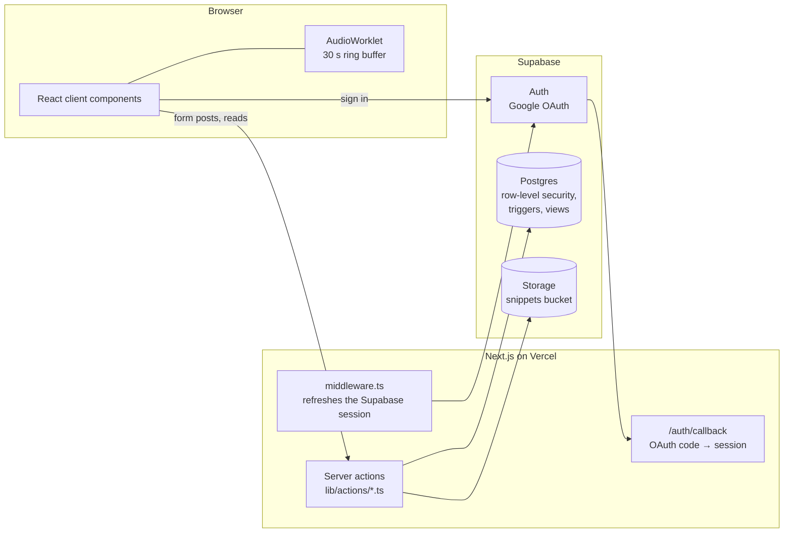

# Virtuoso

A social practice tracker for musicians, like Strava for practice sessions. Musicians time and log their practice, save short audio clips of what they played, follow each other, and compare streaks and totals on a leaderboard.

**Live app:** https://virtuoso-coral.vercel.app (sign in with Google)

Built with Next.js 16 (App Router), React 19, TypeScript, Tailwind CSS and Supabase (Postgres, Auth, Storage).

<!-- TODO(Max): add 2–3 screenshots from the live app here (feed with an audio clip, the practice timer, a profile with the practice calendar). The repo has no images yet. -->

## Features

- **Timed practice sessions.** A stopwatch with breaks: it records when each break happened and how long it lasted, warns before you leave the page mid-session, and saves the instrument (14 choices), piece, skills practiced, notes, and three quick self-ratings (how focused, how much of the piece, how it went). Past sessions can also be entered by hand, edited or deleted.
- **"Capture the moment" audio clips.** While the timer runs, the microphone feeds a 30-second rolling buffer. One click saves the *last* 30 seconds, so you can keep a good take after you have played it. The clip is attached to the session and plays back in the feed.
- **Social graph.** Follow and unfollow, public or private accounts, follow requests (accept or reject) for private accounts, and follower / following lists.
- **Feed.** Your sessions and those of people you follow, newest first, with kudos (likes, with a list of who gave them) and comments.
- **Profiles and stats.** Total time, session count, current streak, and a practice calendar heatmap by week, month or year.
- **Leaderboard.** Top 50 by total practice time, number of sessions, or number of days practiced.

## How it works



- **Server actions do the data work.** Pages call typed server actions (`lib/actions/sessions.ts`, `profile.ts`, `snippets.ts`, `auth.ts`) that run on the server with the user's Supabase session from cookies (`@supabase/ssr`). The only route handler is the OAuth callback.
- **Postgres enforces who sees what.** Row-level security policies let anyone read a public user's sessions, but a private user's sessions only to themselves and to accepted followers (`supabase/migrations/005_follow_requests.sql`). Database triggers create a profile on first sign-in, keep `updated_at` current, and decide whether a new follow is accepted immediately or pending (for private accounts). A `user_stats` view aggregates totals for profiles and the leaderboard.
- **Audio capture without recording everything.** An AudioWorklet (`public/worklets/ring-buffer-processor.js`) writes microphone samples into a preallocated circular buffer sized for 30 seconds, with no allocation in the audio thread. On capture it returns the buffer oldest-first; the client mixes it to mono, downsamples to 22.05 kHz, encodes a WAV file (`lib/audio/wav-encoder.ts`), and a server action uploads it to Supabase Storage (`lib/actions/snippets.ts`).

## Project layout

```
app/                 routes: dashboard (feed), session/new|manual|[id]/edit, profile/[username], leaderboard, requests, settings, login
components/          sessions (timer, recorder, feed cards, modals), profile, leaderboard, layout, ui
lib/actions/         server actions
lib/audio/           WAV encoding
hooks/               useRetroactiveRecorder (drives the AudioWorklet)
supabase/            schema.sql + migrations 001–006
```

## Run it locally

You need Node 20+ and a Supabase project.

1. **Database.** In the Supabase SQL editor, run `supabase/schema.sql`, then each file in `supabase/migrations/` in order (`001`, `002`, `003`, `003b`, `004`, `005`, `006`). `003b` creates the `snippets` storage bucket.
2. **Auth.** In Supabase → Authentication → Providers, enable Google with an OAuth client ID and secret from Google Cloud. Add `http://localhost:3000/auth/callback` (and your deployed URL's `/auth/callback`) to the allowed redirect URLs.
3. **Environment.** Copy `.env.example` to `.env.local` and fill in:

   | Variable | Value |
   |---|---|
   | `NEXT_PUBLIC_SUPABASE_URL` | Project URL (Settings → API) |
   | `NEXT_PUBLIC_SUPABASE_ANON_KEY` | Project anon key |
   | `NEXT_PUBLIC_SITE_URL` | `http://localhost:3000` locally; your deployed URL in production |

4. **Run.**

   ```bash
   npm install
   npm run dev          # http://localhost:3000
   npm run type-check   # tsc --noEmit
   npm run build
   ```

Every page, including the landing page, needs the Supabase variables at request time; `npm run build` works without them.

## Limitations

- No automated tests or CI yet. `npm run lint` still calls `next lint`, which Next.js 16 removed.
- Streaks are counted by UTC date, while the calendar groups sessions by local date, so the two can disagree near midnight.
- Migrations are plain SQL files applied by hand, not managed by the Supabase CLI.
- One audio clip per session.
